# Future Ideas And Implementation Plan

This document tracks features discussed but not implemented yet, plus the intended implementation approach.



## 1) Offline Mode (No Laptop Connected)

### Goal
Run playlist + time + weather behavior after unplugging USB (for example on a battery bank).

### Why current setup is limited
- Current playlist logic is script-driven (`run_playlist.sh`), so it depends on a connected computer.
- Re-uploading different sketches resets the MCU and loses runtime state.

### Proposed approach
- Build one master firmware (single sketch project with multiple source files).
- Convert each effect into a scene/state-machine:
1. wakeup reveal scene
2. matrix rain scene
3. weather/time scene
- Use a scheduler in `loop()` to switch scenes internally without reflashing.

### Implementation outline
1. Create `src/lcd_master_offline/` with:
- `lcd_master_offline.ino` (entry/scheduler)
- `scene_wakeup.*`
- `scene_matrix.*`
- `scene_weather.*`
- `services_clock.*`
- `services_forecast.*`
2. Add scene interface:
- `begin()`
- `tick(now_ms)`
- `isDone()`
3. Scheduler rotates scenes by duration or done-flag.

## 2) Stable Timekeeping Offline

### Goal
Keep correct date/time while disconnected and powered by battery.

### Recommended hardware
- DS3231 RTC module + coin cell backup.

### Fallback
- `millis()`-based relative time (drifts and resets on power cycle).

### Implementation outline
1. Add RTC service wrapper:
- `initClock()`
- `getDateTime()`
- `setDateTime()`
2. Add compile-time switch:
- `USE_RTC true/false`
3. Add one-time sync command from script over serial.

## 3) Preloaded 24-Hour Forecast Cache

### Goal
Fetch forecast once while online, then use hourly values offline all day.

### Storage plan
- Store forecast in EEPROM:
1. version byte
2. start timestamp
3. 24 hourly temps (prefer tenths of degree as `int16_t`)
4. location label/tag
5. CRC/checksum

### Implementation outline
1. Add host script `scripts/provision_forecast.py`:
- fetch geocode + hourly forecast
- send compact payload over serial
2. Add firmware serial provisioning command parser:
- `SET_TIME|...`
- `SET_FORECAST|...`
3. On boot:
- verify checksum
- load forecast if valid
- otherwise show `Wx N/A`.

## 4) Unified Provisioning Flow

### Goal
One command to prepare device for offline run.

### Proposed CLI flow
1. Upload master offline sketch.
2. Push time sync.
3. Push location + 24-hour forecast.
4. Verify acknowledgement/status.

### Candidate command
```bash
./scripts/provision_offline_mode.sh --port /dev/ttyACM0 --location "El Paso" --lat 31.7619 --lon -106.4850
```

## 5) Script UX Improvements

### Ideas
1. Add `--mode online|offline-provision|offline-run` argument support.
2. Add `.env` file support for persistent defaults.
3. Add structured logs (`logs/playlist-YYYYMMDD.log`).
4. Add retry/backoff metrics in output summary.

## 6) Hardware Robustness Improvements

### Ideas
1. Add contrast potentiometer (`VO`) in standard wiring reference.
2. Add optional button input for local scene skip (offline mode).
3. Add optional buzzer cue at scene transition.

## 7) Nice-To-Have Future Integrations

### Raspberry Pi track (separate future project)
1. Use Pi for richer display and media rendering.
2. Keep Arduino as sensor/actuator sidecar over serial/I2C.
3. Build a bridge protocol for weather/time/scene commands.

## 8) Suggested Build Order

1. Master single-firmware scheduler (no reflashing between scenes).
2. RTC service integration (`DS3231`).
3. EEPROM forecast cache + checksum.
4. Provisioning script + serial protocol.
5. Offline test cycle on battery bank.

## 9) Acceptance Criteria (Offline Milestone)

Offline mode is complete when all are true:
1. Device boots with no USB host.
2. Date/time is correct after power cycle (with RTC battery).
3. Playlist runs all scenes continuously.
4. Weather display uses preloaded hourly data.
5. No host script required during runtime.

## 10) Dynamic LCD Geometry Auto-Adaptation

### Goal
Allow users with different character LCD sizes (for example 16x2, 20x4) to run the same project with minimal manual code edits.

### Problem today
Current sketches assume fixed dimensions (`16x2`) and hardcoded layout positions.

### Proposed approach
Use the host script to generate a build-time profile file consumed by all sketches.

### Implementation outline
1. Add user config inputs in script:
- `LCD_COLS`
- `LCD_ROWS`
- optional `LCD_LAYOUT` (for controller memory mapping presets)
2. Add generator step in script before compile:
- writes `src/generated/lcd_profile.h`
- defines:
  - `LCD_COLS`
  - `LCD_ROWS`
  - derived `LCD_CELLS`
  - safe layout helpers
3. Refactor sketches to include shared profile header and remove hardcoded dimensions.
4. Add layout-safe text utilities:
- clipping
- wrapping per row count
- row/col bounds checks
5. Add validation mode:
- fail fast if configured dimensions are out of supported bounds.

### Optional enhancements
1. Add a one-time calibration mode that lets users verify row addressing visually.
2. Add preset profiles for common modules:
- 16x2
- 20x4
- 16x4
3. Add auto-generated sketch metadata so playlist logic can tune hold times by screen size.

## 11) Web Trigger -> LCD Action Pipeline

### Goal
Allow a user to trigger LCD updates from a website/app (for example pressing a button on a web page), while keeping the design safe and easy to replicate with custom domains.

### Candidate approaches

1. Polling model (simplest first)
- Host script polls an endpoint every N seconds for commands.
- If a new command exists, script sends sanitized payload over serial.
- Good for reliability and simple hosting.

2. Push model (lower latency)
- Use WebSocket/MQTT from host device to receive events instantly.
- Host script becomes a long-running client.
- Better UX, but adds infra and reconnect complexity.

3. Self-hosted local control plane
- Run a small local API server (Flask/FastAPI/Node) on the same machine as Arduino.
- Website writes to server, server validates and forwards to serial.
- Easiest to customize and audit for personal setups.

### Components

1. `scripts/web_bridge.py` (future)
- Receives or polls remote commands.
- Applies allowlist validation.
- Sends line payloads to serial feed sketch.

2. Serial command contract in firmware
- Add fixed protocol like: `CMD:SHOW|line1|line2`
- Add `CMD:SCENE|name`
- Add `CMD:PING` and acknowledgement replies.

3. Optional queue persistence
- Store pending commands locally (SQLite/JSONL) to survive restarts.

### Security risks to plan for

1. Unauthorized remote message injection.
2. Replay of old valid commands.
3. Command flooding (DoS) causing serial instability.
4. Oversized/invalid payloads causing display artifacts or parser bugs.
5. Supply-chain risk from random webhook handlers/templates.

### Mitigation plan

1. Require signed requests (HMAC with shared secret) or short-lived API tokens.
2. Add nonce + timestamp checks to prevent replay.
3. Enforce strict payload schema:
- max lengths
- ASCII allowlist
- fixed command verbs
4. Add rate limiting and cooldown logic in script.
5. Keep firmware parser bounded and deterministic (no dynamic `String` parsing).
6. Default-deny:
- ignore unknown command types
- ignore invalid signatures
- log rejections

### Replicability design guidance

1. Keep transport pluggable:
- interface like `fetch_next_command()` with multiple backends (HTTP poll, MQTT, local file).
2. Keep board logic transport-agnostic:
- firmware only consumes serial commands, regardless of where they originated.
3. Put all user-specific values in env/config:
- domain
- API URL
- poll interval
- auth secret path
4. Provide an example `.env.example` and local mock server script so users can test without internet.

### Suggested implementation order

1. Start with local mock file/HTTP polling backend.
2. Add command validation and signature verification.
3. Add queue + retry behavior.
4. Add optional hosted endpoint integration.
5. Document threat model and safe defaults before enabling by default.

## See also

1. [`INDEX.md`](INDEX.md) for roadmap context in the full docs set
2. [`REPLICATION_REQUIREMENTS.md`](REPLICATION_REQUIREMENTS.md) for current baseline setup
3. [`LESSONS_LEARNED.md`](LESSONS_LEARNED.md) for known constraints to avoid repeating
