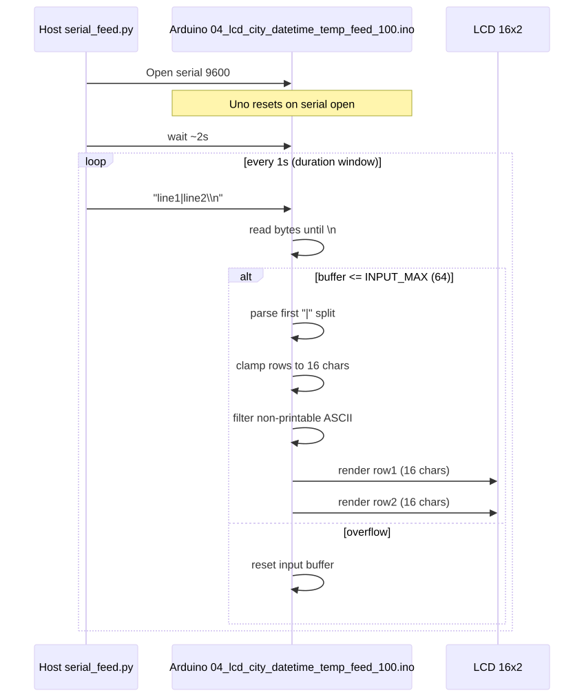

# Serial Protocol

This document defines the current host <-> Arduino serial behavior used by the project.

## Scope

1. `src/playlist/04_lcd_city_datetime_temp_feed_*.ino` input format
2. Host sender behavior from [`scripts/lib/serial_feed.py`](../scripts/lib/serial_feed.py)
3. Playlist completion token behavior (`PLAYLIST_DONE`)
4. Timer command protocol for `src/playlist/06_lcd_afoqt_timer_*.ino`

## Transport

1. Baud rate: `9600`
2. Encoding expectation: ASCII-safe text
3. Line delimiter: newline (`\n`)
4. Carriage return (`\r`) is ignored by parser

## LCD payload format

One newline-delimited payload line:

`line1|line2\n`

Rules:

1. First `|` splits row1 and row2.
2. Additional `|` characters are treated as regular row2 characters after the split.
3. Non-printable ASCII bytes are ignored.
4. Each row is clamped to LCD width (`16` chars).
5. Each render writes full row width to prevent stale trailing characters.

## Parser limits and safety

1. Input buffer max: `64` characters (`INPUT_MAX`).
2. On overflow, parser resets buffer to avoid partial/stale frame rendering.
3. Firmware uses fixed-size buffers (no dynamic `String` parsing in this path).

## Current host behavior

From [`scripts/lib/serial_feed.py`](../scripts/lib/serial_feed.py):

1. Opens serial at `9600`, waits ~2s for Uno reset.
2. Sends one `line1|line2\n` payload per second.
3. Top row alternates every 5s:
   - time (`HH:MM:SS`)
   - date (`Mon DD YYYY`)
4. Top-right 2 chars of row1 are reserved for region tag.
5. Bottom row includes weather + city text (clamped to 16 chars).

## Playlist done token

Current sketches emitting completion token over serial:

1. `src/playlist/03_lcd_wakeup_reveal_*.ino`
2. `src/playlist/02_lcd_matrix_rain_*.ino`

Token string:

`PLAYLIST_DONE`

Host behavior:

1. [`scripts/lib/token_watcher.py`](../scripts/lib/token_watcher.py) watches serial output for this token.
2. If token is found before timeout, host advances to next sketch.
3. If timeout occurs, host continues by fallback timeout rules.

## Compatibility and extension guidance

1. Keep existing `line1|line2\n` format backward-compatible.
2. For future command protocol, use explicit verb prefix, for example:
   - `CMD:SHOW|line1|line2`
   - `CMD:SCENE|name`
   - `CMD:TIMER|START|SECONDS|1800`
3. Add strict verb allowlist and bounded payload validation in firmware and host.

## Timer command protocol

Timer sketches accept newline-delimited commands:

1. `CMD:TIMER|START|SECONDS|<N>`
2. `CMD:TIMER|START|HHMMSS|<HHMMSS>`
3. `CMD:TIMER|PAUSE`
4. `CMD:TIMER|RESUME`
5. `CMD:TIMER|RESET`
6. `CMD:TIMER|STOP`
7. `CMD:TIMER|PING`

Responses:

1. `ACK:TIMER|<VERB>` on accepted command
2. `NACK:TIMER|<CODE>` on validation or format failure
3. `PLAYLIST_DONE` when countdown reaches zero

Safety behavior:

1. Serial-silence fallback applies only while timer is `Paused`.
2. Active `Running` countdown is not interrupted by command silence.

## See also

1. [`../scripts/lib/serial_feed.py`](../scripts/lib/serial_feed.py)
2. [`../scripts/lib/token_watcher.py`](../scripts/lib/token_watcher.py)
3. [`../scripts/lib/timer_control.py`](../scripts/lib/timer_control.py)
4. [`codeflows/src_lcd_serial_feed_code_flow.md`](codeflows/src_lcd_serial_feed_code_flow.md) firmware parser flow
5. [`codeflows/scripts_lib_serial_feed_code_flow.md`](codeflows/scripts_lib_serial_feed_code_flow.md) host sender flow
6. [`codeflows/scripts_lib_token_watcher_code_flow.md`](codeflows/scripts_lib_token_watcher_code_flow.md) done-token watcher flow
7. [`TROUBLESHOOTING.md`](TROUBLESHOOTING.md)
8. [`FUTURE_IDEAS_AND_IMPLEMENTATION_PLAN.md`](FUTURE_IDEAS_AND_IMPLEMENTATION_PLAN.md)
