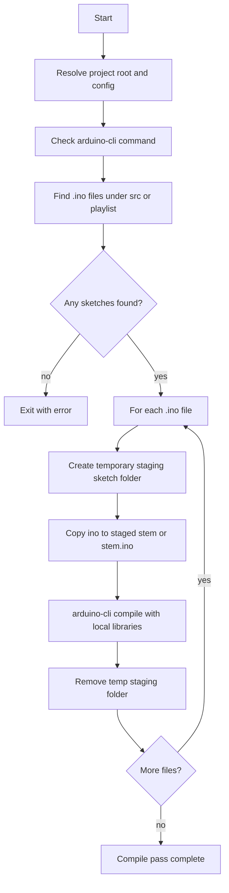

# scripts/compile_playlist_sketches.sh

Code file: [`scripts/compile_playlist_sketches.sh`](scripts/compile_playlist_sketches.sh)

## Flow diagram

## Mermaid source

```mermaid
flowchart TD
  A[Start] --> B[Resolve project root and config]
  B --> C[Check arduino-cli command]
  C --> D[Find .ino files under src or playlist]
  D --> E{Any sketches found?}
  E -->|no| F[Exit with error]
  E -->|yes| G[For each .ino file]
  G --> H[Create temporary staging sketch folder]
  H --> I[Copy ino to staged stem or stem.ino]
  I --> J[arduino-cli compile with local libraries]
  J --> K[Remove temp staging folder]
  K --> L{More files?}
  L -->|yes| G
  L -->|no| M[Compile pass complete]
```
