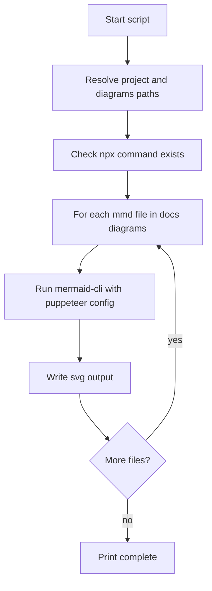

# scripts/generate_diagrams.sh

Code file: `scripts/generate_diagrams.sh`

## Flow diagram

## Mermaid source

```mermaid
flowchart TD
  A[Start script] --> B[Resolve project and diagrams paths]
  B --> C[Check npx command exists]
  C --> D[For each mmd file in docs diagrams]
  D --> E[Run mermaid-cli with puppeteer config]
  E --> F[Write svg output]
  F --> G{More files?}
  G -->|yes| D
  G -->|no| H[Print complete]
```
