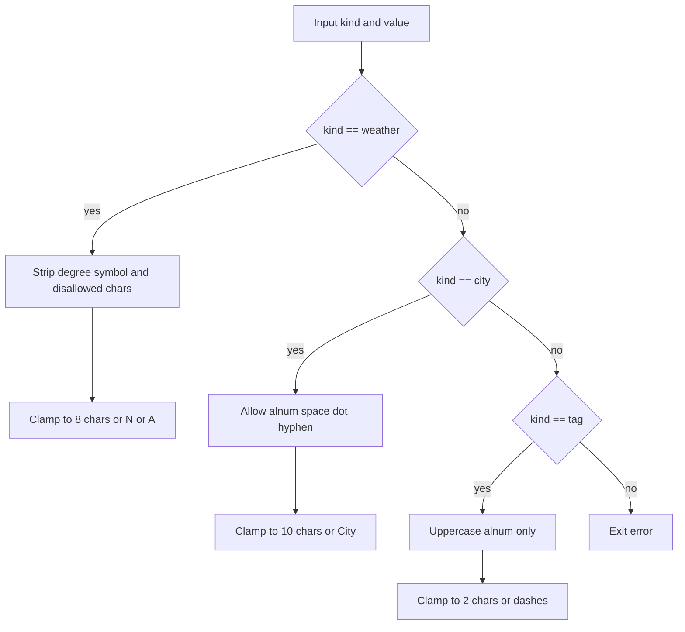

# scripts/lib/sanitize_field.py

Code file: [`scripts/lib/sanitize_field.py`](scripts/lib/sanitize_field.py)

## Flow diagram

## Mermaid source

```mermaid
flowchart TD
  A[Input kind and value] --> B{kind == weather}
  B -->|yes| C[Strip degree symbol and disallowed chars]
  C --> D[Clamp to 8 chars or N or A]
  B -->|no| E{kind == city}
  E -->|yes| F[Allow alnum space dot hyphen]
  F --> G[Clamp to 10 chars or City]
  E -->|no| H{kind == tag}
  H -->|yes| I[Uppercase alnum only]
  I --> J[Clamp to 2 chars or dashes]
  H -->|no| K[Exit error]
```
