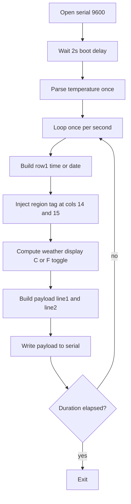

# scripts/lib/serial_feed.py

Code file: [`scripts/lib/serial_feed.py`](scripts/lib/serial_feed.py)

## Flow diagram

## Mermaid source

```mermaid
flowchart TD
  A[Open serial 9600] --> B[Wait 2s boot delay]
  B --> C[Parse temperature once]
  C --> D[Loop once per second]
  D --> E[Build row1 time or date]
  E --> F[Inject region tag at cols 14 and 15]
  F --> G[Compute weather display C or F toggle]
  G --> H[Build payload line1 and line2]
  H --> I[Write payload to serial]
  I --> J{Duration elapsed?}
  J -->|no| D
  J -->|yes| K[Exit]
```
