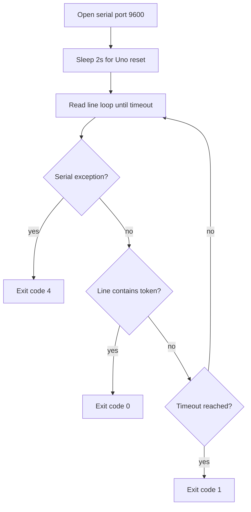

# scripts/lib/token_watcher.py

Code file: `scripts/lib/token_watcher.py`

## Flow diagram

## Mermaid source

```mermaid
flowchart TD
  A[Open serial port 9600] --> B[Sleep 2s for Uno reset]
  B --> C[Read line loop until timeout]
  C --> D{Serial exception?}
  D -->|yes| E[Exit code 4]
  D -->|no| F{Line contains token?}
  F -->|yes| G[Exit code 0]
  F -->|no| H{Timeout reached?}
  H -->|no| C
  H -->|yes| I[Exit code 1]
```
