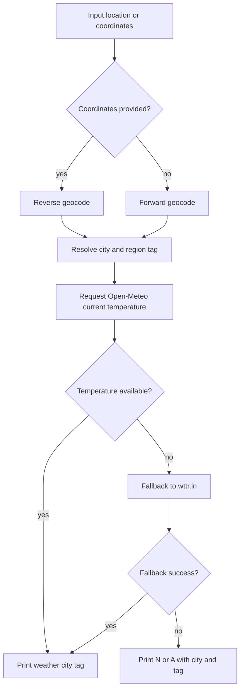

# scripts/lib/weather_meta.py

Code file: `scripts/lib/weather_meta.py`

## Flow diagram

## Mermaid source

```mermaid
flowchart TD
  A[Input location or coordinates] --> B{Coordinates provided?}
  B -->|yes| C[Reverse geocode]
  B -->|no| D[Forward geocode]
  C --> E[Resolve city and region tag]
  D --> E
  E --> F[Request Open-Meteo current temperature]
  F --> G{Temperature available?}
  G -->|yes| H[Print weather city tag]
  G -->|no| I[Fallback to wttr.in]
  I --> J{Fallback success?}
  J -->|yes| H
  J -->|no| K[Print N or A with city and tag]
```
