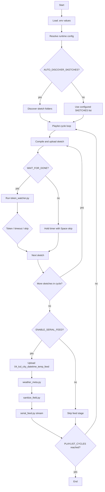

# scripts/run_playlist.sh

Code file: `scripts/run_playlist.sh`

## Flow diagram

## Mermaid source

```mermaid
flowchart TD
  A[Start] --> B[Load .env values]
  B --> C[Resolve runtime config]
  C --> D{AUTO_DISCOVER_SKETCHES?}
  D -->|yes| E[Discover sketch folders]
  D -->|no| F[Use configured SKETCHES list]
  E --> G[Playlist cycle loop]
  F --> G
  G --> H[Compile and upload sketch]
  H --> I{WAIT_FOR_DONE?}
  I -->|yes| J[Run token_watcher.py]
  J --> K{Token / timeout / skip}
  K --> L[Next sketch]
  I -->|no| M[Hold timer with Space skip]
  M --> L
  L --> N{More sketches in cycle?}
  N -->|yes| H
  N -->|no| O{ENABLE_SERIAL_FEED?}
  O -->|yes| P[Upload 04_lcd_city_datetime_temp_feed]
  P --> Q[weather_meta.py]
  Q --> R[sanitize_field.py]
  R --> S[serial_feed.py stream]
  O -->|no| T[Skip feed stage]
  S --> U{PLAYLIST_CYCLES reached?}
  T --> U
  U -->|no| G
  U -->|yes| V[End]
```
