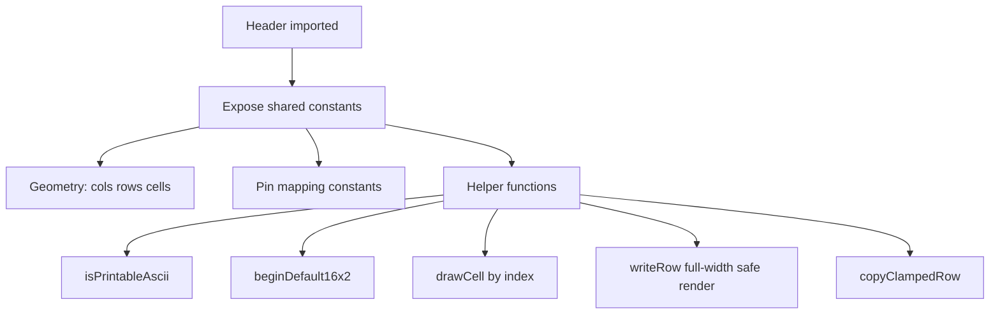

# src/common/lcd_shared/src/lcd_shared.h

Code file: `src/common/lcd_shared/src/lcd_shared.h`

## Flow diagram

## Mermaid source

```mermaid
flowchart TD
  A[Header imported] --> B[Expose shared constants]
  B --> C[Geometry: cols rows cells]
  B --> D[Pin mapping constants]
  B --> E[Helper functions]
  E --> F[isPrintableAscii]
  E --> G[beginDefault16x2]
  E --> H[drawCell by index]
  E --> I[writeRow full-width safe render]
  E --> J[copyClampedRow]
```
