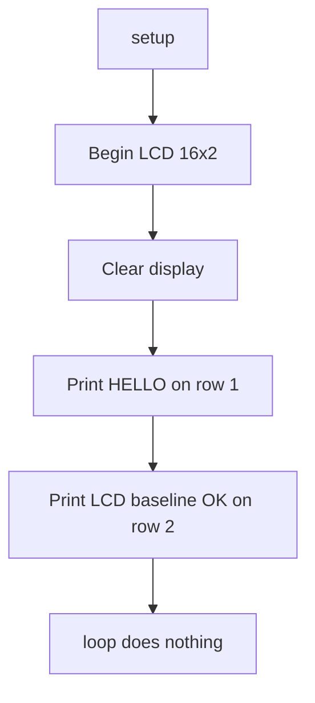

# src/playlist/01_lcd_baseline_010.ino

Code file: `src/playlist/01_lcd_baseline_010.ino`

## Flow diagram

## Mermaid source

```mermaid
flowchart TD
  A[setup] --> B[Begin LCD 16x2]
  B --> C[Clear display]
  C --> D[Print HELLO on row 1]
  D --> E[Print LCD baseline OK on row 2]
  E --> F[loop does nothing]
```
