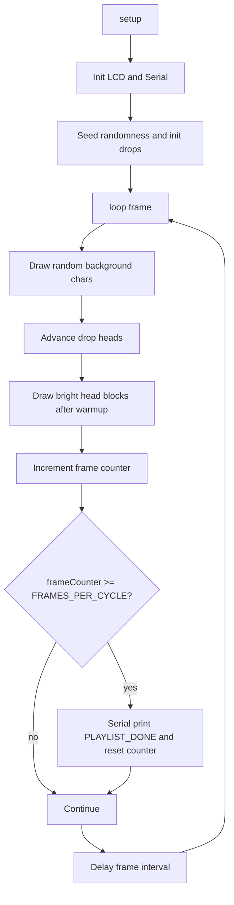

# src/playlist/02_lcd_matrix_rain_000700.ino

Code file: [`src/playlist/02_lcd_matrix_rain_000700.ino`](../../src/playlist/02_lcd_matrix_rain_000700.ino)

## Flow diagram

## Mermaid source

```mermaid
flowchart TD
  A[setup] --> B[Init LCD and Serial]
  B --> C[Seed randomness and init drops]
  C --> D[loop frame]
  D --> E[Draw random background chars]
  E --> F[Advance drop heads]
  F --> G[Draw bright head blocks after warmup]
  G --> H[Increment frame counter]
  H --> I{frameCounter >= FRAMES_PER_CYCLE?}
  I -->|yes| J[Serial print PLAYLIST_DONE and reset counter]
  I -->|no| K[Continue]
  J --> K
  K --> L[Delay frame interval]
  L --> D
```
