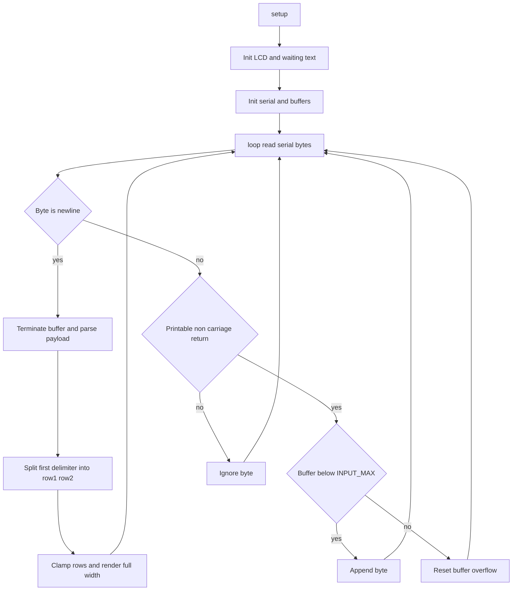

# src/playlist/04_lcd_city_datetime_temp_feed_100.ino

Code file: [`src/playlist/04_lcd_city_datetime_temp_feed_100.ino`](src/playlist/04_lcd_city_datetime_temp_feed_100.ino)

## Flow diagram

## Mermaid source

