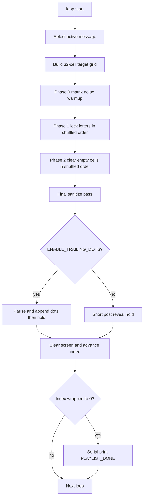

# src/playlist/03_lcd_wakeup_reveal_030.ino

Code file: [`src/playlist/03_lcd_wakeup_reveal_030.ino`](src/playlist/03_lcd_wakeup_reveal_030.ino)

## Flow diagram

## Mermaid source

```mermaid
flowchart TD
  A[loop start] --> B[Select active message]
  B --> C[Build 32-cell target grid]
  C --> D[Phase 0 matrix noise warmup]
  D --> E[Phase 1 lock letters in shuffled order]
  E --> F[Phase 2 clear empty cells in shuffled order]
  F --> G[Final sanitize pass]
  G --> H{ENABLE_TRAILING_DOTS?}
  H -->|yes| I[Pause and append dots then hold]
  H -->|no| J[Short post reveal hold]
  I --> K[Clear screen and advance index]
  J --> K
  K --> L{Index wrapped to 0?}
  L -->|yes| M[Serial print PLAYLIST_DONE]
  L -->|no| N[Next loop]
  M --> N
```
